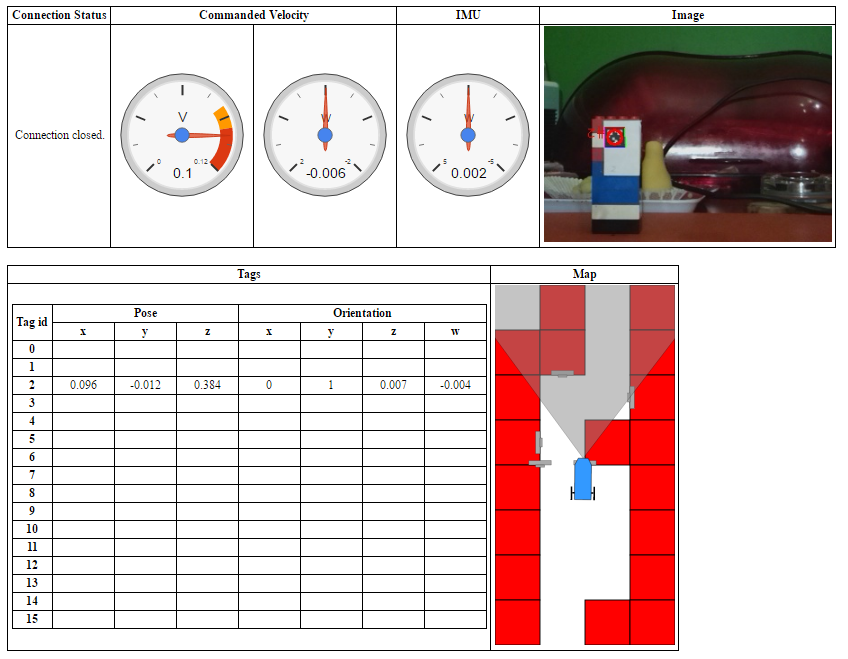

# AR: Browser-Based Instrument Panel

If you are trying to debug your AR, I've created an HTML page that can be used to monitor some of its state. It relies on two additional ROS components:

* rosbridge - see http://wiki.ros.org/rosbridge_suite
* mjpeg\_server - see http://wiki.ros.org/mjpeg_server

Once these are running, the web page can be loaded in a browser to show:

* Commanded velocity
* Yaw detected by the IMU
* The images from the tag detection topic
* The data from the tag detection topic

## Installation (Once Only)

As per the above ROS pages:

    sudo apt-get install ros-indigo-rosbridge-server
    sudo apt-get install ros-indigo-mjpeg-server
    source /opt/ros/indigo/setup.bash

Download the HTML file to your local PC, search for the line containing ROBOT\_IP\_ADDRESS and edit the string so that it is the IP address of your AR.

## Python Changes (Once Only)
In order to publish the map and estimated pose, you'll have to make a few changes to the code (RosInterface.py and RobotControl.py). There are two two diff files: [RosInterface.diff](./RosInterface.diff) and [RobotControl.diff](./RobotControl.diff) for these changes. Needless to say, the line numbers in the diff files may not correspond to your versions, but the changes are:

### RosInterface.py: ###

1 - Import the ROS message types that we'll use.

	from nav_msgs.msg import (
		OccupancyGrid,
		MapMetaData
	)

2 - Create three new publishers (in the constructor method of RosInterface).

	self._mapPub = rospy.Publisher("/map", OccupancyGrid, latch=True)
	self._aprilTagsPub = rospy.Publisher("/aprilTagPoses", PoseArray, latch=True)
	self._estimatedPosePub = rospy.Publisher("/estimatedPose", Pose)
	
3 - Add some new functions.

	def publishMap(self,world_map,occupancy_map,resolution):
		self._mapPub.publish(self._occupancyGridFor(occupancy_map,resolution))
		self._aprilTagsPub.publish(self._poseArrayFor(world_map));

	def publishEstimatedPose(self,x,y,theta):
		self._estimatedPosePub.publish(self._pose(x,y,theta))

	def _pose(self,x,y,theta):
		 p = Pose()
		 p.position.x = x
		 p.position.y = y
		 p.orientation.z = theta
		 return p

	def _poseArrayFor(self,world_map):
		def convertTagToPose(tag):
			return self._pose(tag[0], tag[1], tag[2])

		result = PoseArray()
		result.poses = map(convertTagToPose,world_map.tolist())
		return result

	def _occupancyGridFor(self,occupancy_map,resolution):
		result = OccupancyGrid()
		result.info.height = occupancy_map.shape[0]
		result.info.width  = occupancy_map.shape[1]
		result.info.resolution = resolution
		result.data = occupancy_map.flatten() * 100
		return result

### RobotControl.py: ###

1 - Publish the map and April tag data (in the constructor method of RobotControl).

	self.ros_interface.publishMap(world_map,occupancy_map,x_spacing)
	
Note that I assume that the grid cells are square (because I am using the `nav_msgs/MapMetaData` message type) and so arbitrarily choose `x_spacing` for the resolution parameter.

2 - Publish the estimated pose every time that it is changed.

	self.ros_interface.publishEstimatedPose(state[0],state[1],state[2])

## Use

1 - Start your ROS server/robot node in the usual way:

    roslaunch robot_launch robot.launch
2 - In a new shell, start the rosbridge:

    roslaunch rosbridge_server rosbridge_websocket.launch
3 - In another new shell, start the mjpeg\_server:

    rosrun mjpeg_server mjpeg_server
4 - Open up the HTML page in a browser.

You should see something like this:
  

Quick demo videos:
* https://youtu.be/RYV304ASTuk (an old version)
* https://youtu.be/gidUYmw02I8
