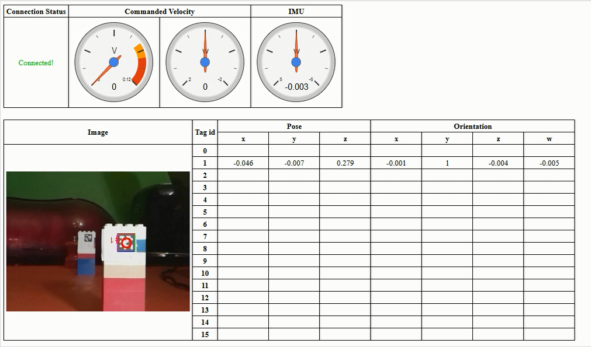

# AR: Browser-Based Instrument Panel

If you are trying to debug your AR, I've created an HTML page that can be used to monitor some of its state. It relies on two additional ROS components:

    rosbridge - see http://wiki.ros.org/rosbridge_suite
    mjpeg_server - see http://wiki.ros.org/mjpeg_server 

Once these are running, the web page can be loaded in a browser to show:

* Commanded velocity
* Yaw detected by the IMU
* The images from the tag detection topic
* The data from the tag detection topic

I've posted the HTML page at https://github.com/IAmContent/studies/blob/master/coursera/robotics-capstone/autonomous-rover/ar-instrument-panel.html

## Installation (Once Only)

As per the above ROS pages:

    sudo apt-get install ros-indigo-rosbridge-server
    sudo apt-get install ros-indigo-mjpeg-server
    source /opt/ros/indigo/setup.bash

Download the HTML file to your local PC, search for the line containing ROBOT_IP_ADDRESS and edit the string so that it is the IP address of your AR.

## Use

* Start your ROS server/robot node in the usual way (via roslaunch robot_launch robot.launch).
* In a new shell, start the rosbridge: roslaunch rosbridge_server rosbridge_websocket.launch
* In another new shell, start the mjpeg_server: rosrun mjpeg_server mjpeg_server
* Open up the HTML page in a browser.

You should see something like this:
  

There is a quick demo video at https://youtu.be/RYV304ASTuk

